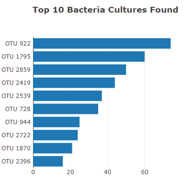
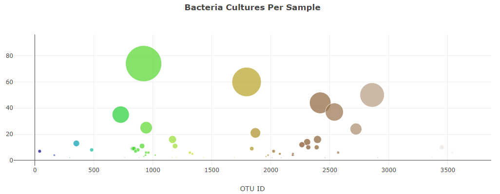
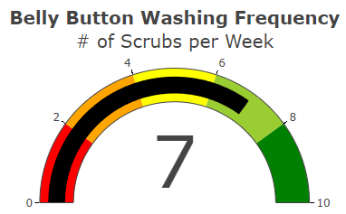
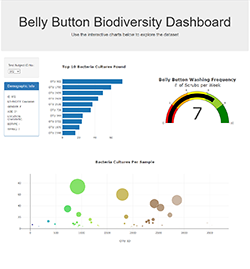
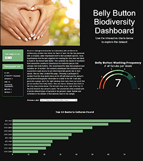
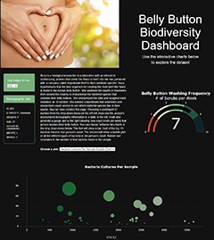

# Belly Button Bacterial Biodiversity with Plotly

## Introduction to Belly Button Bacteria
In this module, Roza is a biological researcher in a laboratory with an interest in synthesizing proteins that mimic the flavor of beef. Her lab has partnered with a company called Improbable Beef to find candidate species. Roza hypothesizes that the best organism for creating the most beef-like flavor is found in the human belly button. She swabbed the navels of volunteers from around the country to characterize the bacterial species that colonize their belly buttons. She anonymized the data and assigned each volunteer an ID number. She wanted a dashboard that volunteers and researchers could access to see which bacterial species live in their navels, thus we have created this page.

Throughout the module, we started designing the webpage with a drop-down menu. Upon choosing a participant ID number from the menu, that person's anonymized demographic information will then be displayed in a table.

As part of this Challenge assignment, we have added some more features to the dashboard as instructed by the deliverables below.

- **Deliverable 1: Create a Horizontal Bar Chart**.
- **Deliverable 2: Create a Bubble Chart**.
- **Deliverable 3: Create a Gauge Chart**.
- **Deliverable 4: Customize the Dashboard**.

The final dashboard webpage can be found here: [https://seanwoodphd.github.io/plotly-biodiversity/](https://seanwoodphd.github.io/plotly-biodiversity/)

## Resources
- Belly Button Data: [samples.json](static/js/samples.json)
- HTML: [index.html](index.html)
- CSS: [style.css](static/css/style.css)
- JavaScript: [charts.js](static/js/charts.js)

## Deliverable 1: Create a Horizontal Bar Chart
A horizontal bar chart was created that displays the top 10 bacterial species (OTUs) when a person selects their ID number from the drop-down menu. An example chart can be seen here:

## Deliverable 2: Create a Bubble Chart
When a person selects their ID number from the drop-down menu, a bubble chart is also created. On this chart, the x-axis represents the OTU ID, the y-axis represents the number of bacterial cultures found, and the size of the bubble correlates to the number of bacterial cultures found.

## Deliverable 3: Create a Gauge Chart
Finally when a person selects their ID number, a gauge chart is created showing how many times per week they wash their belly button.

## Deliverable 4: Customize the Dashboard
The dashboard website was then customized with three or more of the following:
- Add an image to the jumbotron.
- Add background color or a variety of compatible colors to the webpage.
- Use a custom font with contrast for the colors.
- Add more information about the project as a paragraph on the page.
- Add information about what each graph visualizes, either under or next to each graph.
- Make the webpage mobile-responsive.
- Change the layout of the page.
- Add a navigation bar that allows you to select the bar or bubble chart on the page.

I added a picture of a belly button to the jumbotron and changed the colors of the text, background, and plots to be a dark theme with green accents. I rearranged the page slightly as well, adding a paragraph of explanatory text to the spot where the bar chart once stood. Now, either the bar chart or the bubble chart will appear in the large panel at the bottom depending on which option is selected from the new drop-down menu. A picture of the original, non-customized can be seen below on the left. Pictures of the new, customized website can be found

